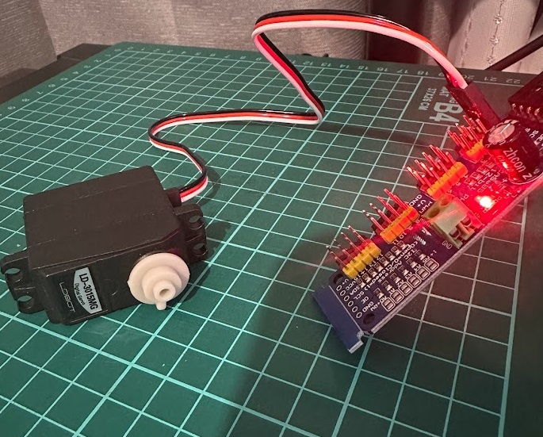

# Jetson-nano-Servomotor on Docker-compose



# Index

- [1. Introduction](#1-introduction)
- [2. Updates!!](#2-updates)
- [3. Coming soon](#3-coming-soon)
- [4. Equipment](#4-equipment)
- [5. Quick Start](#5-quick-start)
  - [5.1. Dockerfile](#51-dockerfile)
  - [5.2. Docker-compose.yml](#52-docker-composeyml)
- [6. サーボモーターサンプルプログラム](#6-サーボモーターサンプルプログラム)
  - [6.1. 初期化](#61-初期化)
  - [6.2. 動作確認](#62-動作確認)
    - [6.2.1. デバイスの確認．](#621-デバイスの確認)
    - [6.2.2. サンプルプログラム](#622-サンプルプログラム)
    - [デモ動画](#デモ動画)
- [7. 角度指定プログラム](#7-角度指定プログラム)
  - [7.1. サーボモータークラス](#71-サーボモータークラス)
  - [7.2. 実行画面](#72-実行画面)
- [8. Reference site](#8-reference-site)

## 1. Introduction

`jetson`でサーボモーターのようなハードが関わっているようなプログラムを動作させようとすると環境構築が毎回大変です．

そこで，`docker-compose`でワンパンで構築できるようにしました．


## 2. Updates!!
* 【2022/12/09】README, サンプルプログラムを追加

## 3. Coming soon
- [ ] 現状特になし

## 4. Equipment

- [NVIDIA Jetson Nano 2GB](https://www.amazon.co.jp/NVIDIA-Jetson-Nano-2GB-%E3%83%87%E3%83%99%E3%83%AD%E3%83%83%E3%83%91%E3%83%BC%E3%82%AD%E3%83%83%E3%83%88/dp/B08J157LHH/ref=sr_1_1?__mk_ja_JP=%E3%82%AB%E3%82%BF%E3%82%AB%E3%83%8A&crid=8HVIOUSSXKOV&keywords=jetson+nano+2gb&qid=1670466285&s=computers&sprefix=jetson+nano+2gb%2Ccomputers%2C297&sr=1-1)
- [ACアダプター 45W USB-C](https://www.amazon.co.jp/gp/product/B0B4BC2V34/ref=ppx_yo_dt_b_asin_title_o03_s00?ie=UTF8&psc=1)
- [フルメタルギアデジタルサーボ 7.4V](https://www.amazon.co.jp/gp/product/B07KK66Z7J/ref=ppx_yo_dt_b_asin_title_o08_s00?ie=UTF8&psc=1)
- [モーター ドライバー PCA9685](https://www.amazon.co.jp/gp/product/B07SLRG5J1/ref=ppx_yo_dt_b_asin_title_o04_s00?ie=UTF8&psc=1)
  

## 5. Quick Start

`docker-compose`を起動します．

```bash
sudo docker-compose up -d
```

### 5.1. Dockerfile

[NVIDIA Deep Learning Institute (DLI) ](https://www.nvidia.com/ja-jp/training/)のイメージを元に作成します．


```Dockerfile
# NVIDIA Deep Learning Institute (DLI)
FROM nvcr.io/nvidia/dli/dli-nano-ai:v2.0.1-r32.5.0

RUN apt-get update 

# I2C 関係
RUN apt-get install i2c-tools
```

### 5.2. Docker-compose.yml

```Dockerfile
version: '3'
services:
  jetson:
    build: .

    # Jupyter Notebook 用のポート
    ports:
    - "8888:8888"
    volumes:
      # 現在の作業フォルダをマウント
      - ./:/home/jetson-nano-servomotor
      # 現在の作業フォルダをマウント
      - /tmp/argus_socket:/tmp/argus_socket

    # GPU 関係
    runtime: nvidia
    devices:
      # WEB カメラ
      - /dev/video0:/dev/video0
      # - /dev:/dev

    # 権限の有効化
    privileged: true

    # コンテナが落ちないように
    tty: true

    # 起動後のディレクトリ
    working_dir: /home/jetson-nano-servomotor
    # working_dir: /home
```

## 6. サーボモーターサンプルプログラム

下記のNOTEBOOKを利用して動かすことができます．

[notebook/Sample_servomotor.ipynb](notebook/Sample_servomotor.ipynb)


下記のリンクから`notebook`にアクセスします．
>http://maki-jetson2:8888/

### 6.1. 初期化

Docker 内で作られたファイルは`root`権限になってしまう．そうすると`VSCode`で編集できないため，ここで権限を緩める．


```python
!chmod 777 -R /home/jetson-nano-servomotor
```

`docker-compose` でマウントした作業フォルダに移動


```python
%cd /home/jetson-nano-servomotor
```
```bash
    /home/jetson-nano-servomotor
```

現在位置の確認


```python
!pwd
```
```bash
    /home/jetson-nano-servomotor
```

### 6.2. 動作確認

#### 6.2.1. デバイスの確認．

ここで`i2c`関係のものが無ければマウントする必要がある．


```python
!ls /dev
```
```bash
    autofs			mtd0ro		    ram10	       tty17  ttyGS0
    bsg			mtdblock0	    ram11	       tty18  ttyS0
    btrfs-control		net		    ram12	       tty19  ttyS1
    bus			network_latency     ram13	       tty2   ttyS2
    console			network_throughput  ram14	       tty20  ttyS3
    constraint_cpu_freq	null		    ram15	       tty21  ttyTHS1
    constraint_gpu_freq	nvhdcp0		    ram2	       tty22  ttyTHS2
    constraint_online_cpus	nvhost-as-gpu	    ram3	       tty23  ttyp0
    cpu_dma_latency		nvhost-ctrl	    ram4	       tty24  ttyp1
    cpu_freq_max		nvhost-ctrl-gpu     ram5	       tty25  ttyp2
    cpu_freq_min		nvhost-ctrl-isp     ram6	       tty26  ttyp3
    cuse			nvhost-ctrl-isp.1   ram7	       tty27  ttyp4
    emc_freq_min		nvhost-ctrl-nvdec   ram8	       tty28  ttyp5
    fb0			nvhost-ctrl-vi	    ram9	       tty29  ttyp6
    fd			nvhost-ctxsw-gpu    random	       tty3   ttyp7
    full			nvhost-dbg-gpu	    rfkill	       tty30  ttyp8
    fuse			nvhost-gpu	    rtc0	       tty31  ttyp9
    gpiochip0		nvhost-isp	    rtc1	       tty32  ttypa
    gpiochip1		nvhost-isp.1	    sda		       tty33  ttypb
    gpu_freq_max		nvhost-msenc	    sda1	       tty34  ttypc
    gpu_freq_min		nvhost-nvdec	    sda10	       tty35  ttypd
    hidraw0			nvhost-nvjpg	    sda11	       tty36  ttype
    hidraw1			nvhost-prof-gpu     sda12	       tty37  ttypf
    hidraw2			nvhost-sched-gpu    sda13	       tty38  uhid
    i2c-0			nvhost-tsec	    sda14	       tty39  uinput
    i2c-1			nvhost-tsecb	    sda2	       tty4   urandom
    i2c-2			nvhost-tsg-gpu	    sda3	       tty40  vcs
    i2c-3			nvhost-vi	    sda4	       tty41  vcs1
    i2c-4			nvhost-vic	    sda5	       tty42  vcs2
    i2c-5			nvmap		    sda6	       tty43  vcs3
    i2c-6			port		    sda7	       tty44  vcs4
    input			ppp		    sda8	       tty45  vcs5
    keychord		psaux		    sda9	       tty46  vcs6
    kmem			ptmx		    sdb		       tty47  vcs7
    kmsg			pts		    shm		       tty48  vcsa
    loop-control		ptyp0		    snd		       tty49  vcsa1
    loop0			ptyp1		    stderr	       tty5   vcsa2
    loop1			ptyp2		    stdin	       tty50  vcsa3
    loop2			ptyp3		    stdout	       tty51  vcsa4
    loop3			ptyp4		    tegra-crypto       tty52  vcsa5
    loop4			ptyp5		    tegra_camera_ctrl  tty53  vcsa6
    loop5			ptyp6		    tegra_cec	       tty54  vcsa7
    loop6			ptyp7		    tegra_dc_0	       tty55  vfio
    loop7			ptyp8		    tegra_dc_ctrl      tty56  vhci
    mapper			ptyp9		    tegra_mipi_cal     tty57  video0
    max_cpu_power		ptypa		    tty		       tty58  watchdog
    max_gpu_power		ptypb		    tty0	       tty59  watchdog0
    max_online_cpus		ptypc		    tty1	       tty6   zero
    media0			ptypd		    tty10	       tty60  zram0
    media1			ptype		    tty11	       tty61  zram1
    mem			ptypf		    tty12	       tty62  zram2
    memory_bandwidth	quadd		    tty13	       tty63  zram3
    min_online_cpus		quadd_auth	    tty14	       tty7
    mqueue			ram0		    tty15	       tty8
    mtd0			ram1		    tty16	       tty9
```

`i2c`の確認．

下記のようになっていれば問題なし．

```bash
     0  1  2  3  4  5  6  7  8  9  a  b  c  d  e  f
00:          -- -- -- -- -- -- -- -- -- -- -- -- -- 
10: -- -- -- -- -- -- -- -- -- -- -- -- -- -- -- -- 
20: -- -- -- -- -- -- -- -- -- -- -- -- -- -- -- -- 
30: -- -- -- -- -- -- -- -- -- -- -- -- -- -- -- -- 
40: 40 -- -- -- -- -- -- -- -- -- -- -- -- -- -- -- 
50: -- -- -- -- -- -- -- -- -- -- -- -- -- -- -- -- 
60: -- -- -- -- -- -- -- -- -- -- -- -- -- -- -- -- 
70: 70 -- -- -- -- -- -- --  
```


```python
!i2cdetect -y -r 1
```
```bash
         0  1  2  3  4  5  6  7  8  9  a  b  c  d  e  f
    00:          -- -- -- -- -- -- -- -- -- -- -- -- -- 
    10: -- -- -- -- -- -- -- -- -- -- -- -- -- -- -- -- 
    20: -- -- -- -- -- -- -- -- -- -- -- -- -- -- -- -- 
    30: -- -- -- -- -- -- -- -- -- -- -- -- -- -- -- -- 
    40: 40 -- -- -- -- -- -- -- -- -- -- -- -- -- -- -- 
    50: -- -- -- -- -- -- -- -- -- -- -- -- -- -- -- -- 
    60: -- -- -- -- -- -- -- -- -- -- -- -- -- -- -- -- 
    70: 70 -- -- -- -- -- -- --                         
```

#### 6.2.2. サンプルプログラム

こちらを実行すると動作するはず．


```python
# Simple demo of of the PCA9685 PWM servo/LED controller library.
# This will move channel 0 from min to max position repeatedly.
# Author: Tony DiCola
# License: Public Domain
from __future__ import division
import time
import os
import sys

sys.path.append('./modules')

# Import the PCA9685 module.
import Adafruit_PCA9685
 

# Uncomment to enable debug output.
#import logging
#logging.basicConfig(level=logging.DEBUG)
 
# Initialise the PCA9685 using the default address (0x40).
pwm = Adafruit_PCA9685.PCA9685()
 
# Alternatively specify a different address and/or bus:
#pwm = Adafruit_PCA9685.PCA9685(address=0x41, busnum=2)
 
# Configure min and max servo pulse lengths
servo_min = 150  # Min pulse length out of 4096
servo_max = 600  # Max pulse length out of 4096
 
# Helper function to make setting a servo pulse width simpler.
def set_servo_pulse(channel, pulse):
    pulse_length = 1000000    # 1,000,000 us per second
    pulse_length //= 60       # 60 Hz
    print('{0}us per period'.format(pulse_length))
    pulse_length //= 4096     # 12 bits of resolution
    print('{0}us per bit'.format(pulse_length))
    pulse *= 1000
    pulse //= pulse_length
    pwm.set_pwm(channel, 0, pulse)
 
# Set frequency to 60hz, good for servos.
pwm.set_pwm_freq(60)
 
print('Moving servo on channel 0, press Ctrl-C to quit...')
while True:
    # Move servo on channel O between extremes.
    i = 0
    pwm.set_pwm(i, 0, servo_min)
    time.sleep(1)
    pwm.set_pwm(i, 0, servo_max)
    time.sleep(1)
```

#### デモ動画

<iframe width="621" height="1104" src="https://www.youtube.com/embed/TDtZmjuElgE" title="Jetson-nano-Servomotor on Docker-compose（DEMO）" frameborder="0" allow="accelerometer; autoplay; clipboard-write; encrypted-media; gyroscope; picture-in-picture" allowfullscreen></iframe>

## 7. 角度指定プログラム

角度を指定してサーボモーターを動かします．今回は角度を0～180度に変化させるプログラムを紹介します．
### 7.1. サーボモータークラス

`modules/ServoClass.py`

```python
class ServoClass:
    #ChannelはPCA9685のサーボモータの接続チャンネル
    #ZeroOffsetはサーボモータの基準位置調節用パラメータ
    def __init__(self, Channel, ZeroOffset):
        self.Channel = Channel
        self.ZeroOffset = ZeroOffset

        #Adafruit_PCA9685の初期化
        self.pwm = Adafruit_PCA9685.PCA9685()
        self.pwm.set_pwm_freq(int(60))

    # 角度設定
    def SetPos(self, pos):
        #PCA9685はパルスで角度を制御しており、パルス150~650が角度0~180に対応
        pulse = int((650-150)/180*pos+150+self.ZeroOffset)
        self.pwm.set_pwm(self.Channel, 0, pulse)

    # pulse 設定
    def SetPulse(self, pulse):
        self.pwm.set_pwm(self.Channel, 0, pulse)
        
    # 終了処理
    def Cleanup(self):
        #サーボを90°にセット
        # self.SetPos(int(90))
        self.SetPos(0)
        logger.info("SetPos 0")
```

### 7.2. 実行画面

`script/in_docker.sh`でコンテナの中に入ります．

```bash
maki@maki-jetson2:~/Documents/jetson-nano-Servomotor$ ./script/in_docker.sh 
root@88d8884ca43a:/home/jetson-nano-servomotor#
```

`modules/ServoClass.py`を実行します．

```bash
root@88d8884ca43a:/home/jetson-nano-servomotor# python3 modules/ServoClass.py 
2022-12-08 08:57:39.676 | INFO     | __main__:<module>:47 - deg : 0
2022-12-08 08:57:40.179 | INFO     | __main__:<module>:47 - deg : 2
2022-12-08 08:57:40.682 | INFO     | __main__:<module>:47 - deg : 4
2022-12-08 08:57:41.185 | INFO     | __main__:<module>:47 - deg : 6
2022-12-08 08:57:41.688 | INFO     | __main__:<module>:47 - deg : 8
2022-12-08 08:57:42.191 | INFO     | __main__:<module>:47 - deg : 10
2022-12-08 08:57:42.699 | INFO     | __main__:<module>:47 - deg : 12
2022-12-08 08:57:43.209 | INFO     | __main__:<module>:47 - deg : 14
2022-12-08 08:57:43.715 | INFO     | __main__:<module>:47 - deg : 16
2022-12-08 08:57:44.219 | INFO     | __main__:<module>:47 - deg : 18
2022-12-08 08:57:44.725 | INFO     | __main__:<module>:47 - deg : 20
2022-12-08 08:57:45.235 | INFO     | __main__:<module>:47 - deg : 22
2022-12-08 08:57:45.742 | INFO     | __main__:<module>:47 - deg : 24
2022-12-08 08:57:46.245 | INFO     | __main__:<module>:47 - deg : 26
2022-12-08 08:57:46.747 | INFO     | __main__:<module>:47 - deg : 28
2022-12-08 08:57:47.250 | INFO     | __main__:<module>:47 - deg : 30
2022-12-08 08:57:47.753 | INFO     | __main__:<module>:47 - deg : 32
```


## 8. Reference site

- [Jetson Xavier NXでJetRacerを構築](https://qiita.com/akira-sasaki/items/015525fb3f0079b14dbf)
- [JetPack Archive](https://developer.nvidia.com/embedded/jetpack-archive)
- [DockerコンテナからRaspberryPiのGPIO・I2C・シリアル通信を使う](https://qiita.com/myasu/items/e3bf8641a9e94dd3e5dd)
- [Jetson nanoとPCA9685でサーボを動かそうとするときのI2Cエラー対処法！](https://kokensha.xyz/jetson/jetson-nano-pca9685-i2c-error-resolution/)
- [ラズパイとサーボドライバ(PCA9685)でサーボモータ制御](https://python-academia.com/raspberrypi-pca9685-servo/)

